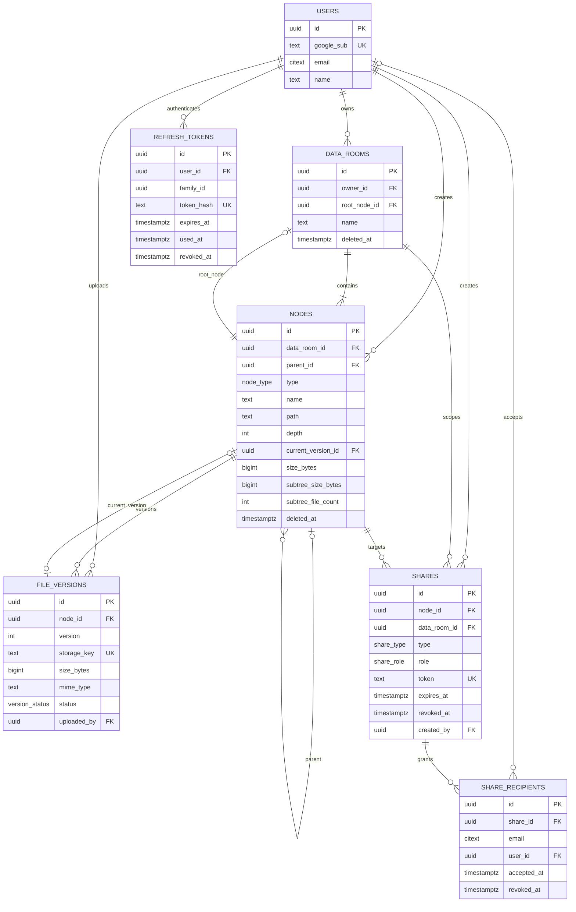

# Data Room

A virtual data room for due-diligence workflows. Owners organize documents into nested folders,
upload files directly to private object storage, and grant read-only access through public links or
email-addressed invitations. Shared users see only the subtree they were granted, and revocation is
effective on the next request.

The workspace contains a React 18/Vite client, a NestJS 10 API, PostgreSQL 15 via TypeORM, a shared
Zod contract package, and Playwright end-to-end tests. Supabase Storage is the production object
store; file bytes never pass through the API.

## Current status

The application code, database migrations, fixture seed, unit/integration/contract/component tests,
and local MSW experience are implemented. No public deployment URL is published from this checkout.
Live Google OAuth, the cross-origin production cookie, and raw browser upload progress still require
the external Google, Supabase, Render, and Vercel credentials described below.

The findings of the 19 August security review and QA audit have been remediated in this checkout —
see **Security posture** below for what each control now is, and its **Accepted exceptions** table
for the three that were deliberately left standing with reasons.

Refresh-token reuse has a 15-second browser-tab race window, but a second presenter receives the
exact successor already issued rather than a new credential. See the deviations register for the
single-instance limitation and fail-closed behavior.

## What is implemented

- Google OAuth with short-lived access JWTs and rotating, hashed refresh tokens in an `httpOnly`
  cookie.
- Multiple owner data rooms, nested folders, breadcrumbs, keyset-paginated listings, rename, move,
  subtree deletion, exact delete previews, and cached rollups with a nightly drift audit.
- Direct-to-storage multi-file uploads with real XHR progress, concurrency limiting, retry on the
  same reservation, abandoned-upload cleanup, and zero-byte file support.
- In-app PDF viewing and signed 60-second preview/download redirects; other allowed file types remain
  downloadable.
- Public-link and permissioned sharing at room, folder, or file level; immediate revocation and six
  designed access-failure states.
- Row virtualization, keyboard navigation, responsive layouts, reduced-motion support, and rollback
  for optimistic browser mutations.

Filename search and user-editable version history are intentionally not exposed. The schema already
supports file versions; subtree search is designed for a later indexed implementation.

## Architecture

```text
React SPA  ── JSON + credentials ──>  NestJS API  ──>  PostgreSQL
    │                                      │
    └── signed PUT/GET, file bytes ────────┴────>  private Supabase Storage
```

The important boundaries are:

- `packages/contracts` is the API source of truth. Backend contract tests parse every JSON response
  with strict Zod schemas, and the frontend parses responses against those same schemas.
- `PermissionService`, reached through `ReadAccessGuard` and `OwnerGuard`, is the only place that
  decides access. Permission results are never cached, so revocation cannot leave a stale grant.
- Storage is private. The API grants one short-lived signed URL only after its access guard succeeds;
  it never proxies bytes or exposes the Supabase service-role key to the browser.
- PostgreSQL migrations are authoritative and `synchronize` is always disabled. Multi-row tree,
  upload, share, and rollup changes are transactional.

### Principal design decisions

1. **Adjacency list plus materialized path.** Each node stores `parent_id` and a UUID-only `path`
   such as `/root/folder/node/`. Breadcrumbs, subtree scans, and permission ancestry checks avoid
   recursive queries. Moving a subtree costs one transactional prefix rewrite.
2. **Folders and files share one node table.** Rename, move, delete, breadcrumb, and sharing behavior
   has one implementation. File metadata is nullable on folders; cached rollups are meaningful on
   folders.
3. **Uploads reserve before bytes move.** `init` creates an invisible placeholder and pending version,
   then returns a signed write URL. `complete` verifies the object and atomically promotes it. Retry
   reuses the reservation, while abort and the 24-hour sweeper remove abandoned reservations.
4. **Shares target nodes.** Sharing a whole room means sharing its root node. Public links and named
   recipients therefore use the same subtree authorization path, and breadcrumbs are truncated at
   the granting node.
5. **Keyset pagination and virtualized rows from the start.** Folder cost stays stable as it grows,
   inserts cannot create `OFFSET` skips, and the browser does not render an unbounded DOM list.
6. **Database constraints decide name conflicts.** Writes attempt the insert/update and map PostgreSQL
   `23505`; there is no check-then-write race.

## Repository layout

```text
apps/api/             NestJS API, migrations, seed, and backend tests
apps/web/             React client, MSW handlers, and component tests
packages/contracts/   shared Zod request/response contracts and canonical fixtures
e2e/                  Playwright flows and session harness
scripts/              commit ownership validation
```

## Local setup

### Prerequisites

- Node.js 22 recommended (20 or newer is supported)
- pnpm 9.15.9 through Corepack
- Docker with Compose for local PostgreSQL and for backend integration tests
- For the real full stack: a Google OAuth client and a Supabase project with a private Storage bucket

Enable the repository's pinned package manager and install exactly the lockfile:

```bash
corepack enable pnpm
pnpm install --frozen-lockfile
pnpm --filter @dataroom/contracts build
```

**If `corepack enable` cannot write to the Node bin directory** — a locked-down shell, or a
system-managed Node — put a Corepack shim in a directory you own and keep it on `PATH` for
everything that follows:

```bash
pnpm_shim=$(mktemp -d)
corepack enable --install-directory "$pnpm_shim"
export PATH="$pnpm_shim:$PATH"

pnpm install --frozen-lockfile
pnpm --filter @dataroom/contracts build
```

Prefixing individual commands with `corepack` is **not** enough. `corepack pnpm install` works, but
`corepack pnpm test` fails with `sh: 1: pnpm: not found`, because the root scripts are themselves
written in terms of `pnpm`:

```
> pnpm --filter @dataroom/contracts test && pnpm --filter @dataroom/api test:coverage && …
```

The nested call is looked up on `PATH` like any other command, and `corepack` only ever satisfied
the outer one. Every root script — `test`, `lint`, `typecheck`, `build`, `db:*` — has this shape.

### Option A: run the frontend with MSW, no accounts or backend

This is the fastest way to inspect the complete UI and its mutable fixture tree:

```bash
pnpm --filter @dataroom/web exec msw init public/ --no-save
VITE_USE_MSW=true pnpm dev:web --host 127.0.0.1 --strictPort
```

Open `http://127.0.0.1:5173`. The generated service-worker file is intentionally untracked and must
be created once per clean clone. MSW is development-only and the production build is checked to make
sure it contains neither the worker nor the mock handlers.

Two details in that command, both of which have already cost someone an afternoon:

- **`--host 127.0.0.1` is not optional.** Left to itself Vite prints `http://localhost:5173/` and
  listens on `[::1]` only, so the IPv4 address above refuses the connection while the server insists
  it is running. `--strictPort` then makes a port clash fail loudly instead of silently moving to
  5174 and leaving you refreshing the wrong tab.
- **Do not write `pnpm dev:web -- --host 127.0.0.1`.** The `--` separator is passed through to Vite,
  which stops parsing options at it and ignores every flag that follows — the server starts, the
  flags are dropped, and the failure looks exactly like the one above.

These instructions were last re-run end to end on 2026-08-19, from a `git clone --no-hardlinks` of
this repository into an empty directory, in a shell with no `pnpm` on `PATH`: Corepack shim, frozen
install, contracts build, `msw init`, Vite bound to `127.0.0.1`, then `curl` against both
`http://127.0.0.1:5173` and `http://127.0.0.1:5173/mockServiceWorker.js`, and finally a headless
browser confirming the fixture room renders. Following instructions is the only way to know they
work; believing them is not.

### Option B: run the real local stack

Copy the complete environment template:

```bash
cp .env.example .env
```

Replace every empty or placeholder value in `.env`:

- Create a Google OAuth consent screen using `openid`, `email`, and `profile`, then register the
  callback **exactly** as `GOOGLE_CALLBACK_URL` spells it —
  `http://127.0.0.1:3000/api/v1/auth/google/callback`. Google treats `localhost` and `127.0.0.1` as
  different redirect URIs; register both if you intend to use both.
- Create a **private** Supabase Storage bucket matching `SUPABASE_BUCKET`. Put the Supabase URL and
  service-role key only in the API environment; never expose the key through a `VITE_` variable.
- Generate distinct access and refresh secrets, for example with `openssl rand -base64 48` twice.
- Keep local cookies at `COOKIE_SAMESITE=lax` and `COOKIE_SECURE=false`.

The API reads the repo-root `.env` and exits before listening if a required value is missing or
invalid. Start and prepare PostgreSQL:

```bash
pnpm db:up
pnpm db:migrate
pnpm db:seed
```

The seed is repeatable: it rebuilds only the canonical fixture room and preserves unrelated rooms.
Then run the two applications in separate terminals:

```bash
pnpm dev:api
```

```bash
VITE_API_URL=http://127.0.0.1:3000 VITE_USE_MSW=false pnpm dev:web --host 127.0.0.1 --strictPort
```

**Use one host everywhere — `127.0.0.1` here, since that is what the URLs below say.** CORS is an
exact-origin match with credentials, so an API started with `WEB_ORIGIN=http://localhost:5173` while
the browser is on `http://127.0.0.1:5173` rejects every request the app makes. What you see then is
not an error page: the app renders its signed-out landing screen, exactly as if the session had
expired. `.env.example` ships `127.0.0.1` for that reason, and the refresh cookie is host-only, so
mixing the two hosts breaks the session for the same reason twice.

Useful checks:

- Web: `http://127.0.0.1:5173`
- API health: `http://127.0.0.1:3000/api/v1/health`
- Google sign-in starts at `http://127.0.0.1:3000/api/v1/auth/google`

The real-browser raw `PUT` path to a Supabase signed upload URL remains an external verification item.
Before relying on uploads in a deployment, confirm the bucket's CORS behavior and that
`xhr.upload.onprogress` fires for a representative file. If Supabase does not support this exact path,
the fallback is resumable/TUS or presigned S3 and requires an API-contract change.

## Verification

The authoritative local/CI gate is:

```bash
pnpm test
```

It runs the contracts fixture tests, API coverage suite, and web coverage suite with the configured
thresholds. `pnpm test:fast` is an ungated inner loop, not a completion check.

Run the complete static and build checks with:

```bash
pnpm lint
pnpm --filter @dataroom/contracts build
pnpm typecheck
pnpm build
```

Backend integration and contract tests start a PostgreSQL Testcontainer and migrate it from empty;
they do not use the developer database. The Playwright suite expects a separately running stack and
the canonical seed:

```bash
set -a; . ./.env; set +a          # DATABASE_URL and JWT_ACCESS_SECRET, from the same file the API read
E2E_WEB_URL=http://127.0.0.1:5173 \
E2E_API_URL=http://127.0.0.1:3000 \
pnpm test:e2e
```

**`DATABASE_URL` must be the API's database, not merely *a* database.** The harness upserts its
identities directly over SQL while the API reads through its own connection, so pointing the two at
different databases produces a suite in which every login fails — and it fails as the signed-out
landing page, which looks exactly like a broken session rather than like a misconfiguration. Sourcing
`.env` rather than pasting a connection string is what makes that impossible; a hardcoded
`postgres://…@localhost:5432/dataroom` in this command was worth fifteen misleading failures once.

The stack it points at must have been started with `WEB_ORIGIN` equal to `E2E_WEB_URL`, for the CORS
reason above; the browser-driven flows fail on the signed-out landing page otherwise.

The harness serializes independent Playwright processes on the same host before they can contend for
the public share endpoint's per-IP rate limit. It keys the process lock by `E2E_API_URL`; when two
aliases reach the same target, give both runs the same `E2E_SHARE_LOCK_KEY`. Distributed CI runners
still need the CI provider's concurrency control because a host-local lock cannot cross machines.

44 tests. Against a local stack, **40 pass and 4 skip**. The four are the flows that move bytes:
`POST /uploads/init` mints a signed upload URL before it answers, so without a real Supabase bucket
they fail on a 500 that says nothing about the behaviour under test. They are gated rather than left
red — set `E2E_STORAGE_READY=true` once a bucket with CORS exists, and they run. Nothing else in the
suite is skipped or conditional.

Playwright injects sessions from its own harness rather than adding a production login backdoor.
The actual Google round trip is intentionally a manual deployment check.

## Data model



`data_rooms.root_node_id` is nullable only to allow the circular room/root creation transaction; a
committed room always has a root. Nodes and rooms are soft-deleted, while share revocation is retained
as history. Pending upload placeholders have no `current_version_id` and are excluded from listings and
rollups.

## How it scales

### 1. Total folder size and item count

Exact stats and delete previews use the materialized path as an indexed prefix range, not a recursive
walk. The `text_pattern_ops` path index matters because it lets PostgreSQL use a btree for
`LIKE 'prefix%'` outside the C collation.

Listings read `subtree_size_bytes` and `subtree_file_count` cached on each folder. Upload, delete, and
move transactions update the already-known ancestor IDs in O(depth). A nightly job recomputes every
live folder from completed file nodes and logs drift. It does not auto-repair mismatches because the
mismatch is evidence of a broken transactional mutation path.

If concurrent writes make the room root a hot row, the next tier is an append-only delta ledger:
writers append without contending, a worker compacts deltas, and reads use cached values plus pending
deltas.

### 2. A room with 100,000 files

The model stays the same. Listings use a `(type, sort value, id)` keyset cursor and a partial sibling
index, so later pages do not scan and discard earlier rows. The client fetches bounded pages and
virtualizes rows. Cached header counts avoid repeated full aggregates, while destructive previews remain
exact and run only when opened.

Subtree operations continue to use the materialized-path index. Search would add a normalized-name
column and a room-scoped `pg_trgm` GIN index rather than `LIKE '%term%'`; at multi-million-file scale or
for content search it moves to a dedicated search service. Moves/deletes above a measured threshold
become queued `202` jobs with progress, using the same SQL in a safer execution context. UUID-only flat
storage keys need no directory redesign.

### 3. Per-user viewer/editor roles

The grant already owns its `role`, guards already consume a role rather than a boolean, and overlapping
grants resolve most-permissive-first. Adding `editor` therefore means extending the database/contract
enum, adding permission-matrix cells, and replacing owner-only mutation guards with a role requirement.
It does not remodel the tree or share-recipient tables. The same separation can later absorb group
recipients, deny rules, download restrictions, expiry, or network constraints inside the permission
boundary.

## Deployment notes

The intended topology is a long-running Nest service on Render/Railway, a Vite build on Vercel,
Supabase PostgreSQL/Storage, and Google OAuth. Production must use:

- the exact deployed `WEB_ORIGIN` for credentialed CORS;
- `COOKIE_SAMESITE=none` with `COOKIE_SECURE=true`;
- the deployed `/api/v1/auth/google/callback` registered with Google;
- `VITE_API_URL` set to the API origin and no secret under any `VITE_` name;
- a private bucket and a backend-only Supabase service-role key;
- migrations and the seed run deliberately against the selected database.

Before calling a deployment verified, test the refresh cookie in Safari and Chrome incognito, perform a
real multi-file upload with visible progress, open and download a file, and confirm a revoked share fails
on the very next request.

### Two production settings that fail silently if you skip them

Both are now enforced by the environment schema, so a misconfigured deploy stops at boot rather than
at rest. They are called out because their failure modes are invisible:

- **`DATABASE_URL` must carry `?sslmode=require`.** `node-postgres` speaks plaintext unless asked
  otherwise, and the API and the database are on different hosts. Without it, refresh-token hashes
  and share-recipient addresses cross the public internet in the clear, and nothing anywhere reports
  it — the only way it surfaces is if the server happens to *refuse* the cleartext connection.
  `sslmode=prefer` and `allow` do not count; both fall back silently.
- **`TRUST_PROXY_HOPS` must be `1`** (already set in `render.yaml`). Express leaves `req.ips` empty
  unless it trusts a proxy, so behind a platform load balancer every visitor keys to the same
  rate-limit bucket and the 10/min limit on `GET /shared/:token` becomes 10/min for the entire
  internet. It is a hop *count* and not `true`, because `true` trusts the whole `X-Forwarded-For`
  chain and lets any caller mint themselves unlimited buckets by prepending an address.

## Security posture

The controls that are load-bearing, and the exceptions that are deliberate.

**Where access is decided.** One service (`PermissionService`), behind one guard, never cached, so
revocation takes effect on the next request. No ownership check exists anywhere outside
`permissions/`.

**Redirects.** `isSafeReturnTo` in `@dataroom/contracts` is the single definition of "same-origin
path", used by the client gate, the sign-in URL builder and the server's OAuth `state` validation.
It rejects `//host`, `/\host`, percent-encoded backslashes and control characters — the browser URL
parser treats `\` as `/` in the authority position, and strips tab/CR/LF before parsing, so all of
those resolve off-origin. Three hand-rolled copies of a weaker rule is how the backslash bypass got
in; there is deliberately one now, with the full case list pinned in both suites.

**Uploaded bytes.** The declared MIME type becomes a fact about the file only at `complete`, which
reads back the content type storage recorded and refuses to promote a version that disagrees — the
browser writes that header itself on its direct `PUT`, so the allowlist at `init` is a claim until
then. `GET /nodes/:id/content` additionally serves `inline` only for `PREVIEWABLE_MIME_TYPES`;
everything else is a download regardless of what the caller asked for. Two independent failures
would be needed to get arbitrary markup rendered from the storage origin.

**Signed URLs.** Reads live 60 seconds; writes live 15 minutes and only `retry` may overwrite. A
write grant is a live capability to replace the bytes at a key, so a longer one meant a completed,
shared, already-read version could be swapped out from under its recipients.

**Rate limiting.** Every route, keyed per client IP: 1,200/min globally (`RATE_LIMIT_PER_MINUTE`),
300/min on the public auth routes, 120/min on `/health` (which runs a real query), 10/min on
`GET /shared/:token`. These bound resource exhaustion, not guessing — the refresh token is 48 random
bytes and the share token 32, so neither is reachable by brute force at any rate.

**Cross-site.** The refresh cookie is `SameSite=None` in production by necessity, so `SameOriginGuard`
refuses `POST /auth/refresh` and `POST /auth/logout` when the browser reports an `Origin` other than
`WEB_ORIGIN`. Without it, any page could spend a visitor's refresh token and log their other tabs
out. `vercel.json` serves the SPA with a CSP (`frame-ancestors 'none'`, `object-src 'none'`,
`worker-src 'self' blob:` for pdf.js), HSTS, `X-Frame-Options`, `nosniff`, and a
`strict-origin-when-cross-origin` referrer policy — the last matters specifically because share
tokens live in the URL path.

**Share tokens and OAuth.** `returnTo` is stashed in `sessionStorage` under a random key and only
the key travels through the OAuth `state`, so a `/s/<token>/…` path is never handed to Google. The
`state` parameter is encoding, not encryption.

**Housekeeping.** Expired refresh-token rows are pruned nightly; a revoked row is kept for a full
refresh lifetime past revocation, because it is what makes a replay *detectable* rather than an
ordinary "no such token".

### Accepted exceptions

| Item | Why it stands |
| --- | --- |
| `@nestjs/core` GHSA-36xv-jgw5-4q75 (moderate) | CRLF injection in `SseStream`. This API declares no SSE route, so the code path is unreachable. The fix is `>=11.1.18`, a Nest major upgrade that also moves `platform-express` to Express 5 — scheduled, not skipped. `pnpm audit --prod --audit-level=high` is the CI gate, so this does not block a build; every advisory above moderate resolves through `pnpm.overrides` in the root `package.json`. |
| Logout does not invalidate an already-issued access token | It is a stateless JWT with a 15-minute TTL; logout revokes the whole refresh family, so the window is bounded and non-renewable. Making it revocable means a denylist checked on every request, which trades the property this design was chosen for. Stated rather than assumed. |
| Successor sharing uses a 15-second in-process cache | Render's current API deployment is a single instance, so racing tabs converge on the exact same refresh and access tokens. A cache miss revokes the family rather than minting anything. If the API scales to multiple instances, a shared ephemeral store such as Redis is required to preserve that multi-tab behavior. |

## Deviations register

The implementation plan records deliberate changes as Contract Change Protocol notes:

| Note  | Status                     | Decision and rationale                                                                                                                                                                                                                                      |
| ----- | -------------------------- | ----------------------------------------------------------------------------------------------------------------------------------------------------------------------------------------------------------------------------------------------------------- |
| CCP-1 | Applied                    | Added Nest peer dependencies, SWC decorator transforms, coverage/RTL tooling, a pinned pdf.js worker dependency, and contract-package test tooling required by the chosen stack.                                                                            |
| CCP-2 | Applied                    | Replaced the ineffective global `nestjs-zod` approach with a small per-parameter `ZodValidationPipe`, keeping the exact contract schema visible at each controller boundary and mapping validation details consistently.                                    |
| CCP-3 | Applied                    | Added server-side `refresh_tokens`; hashed rotating tokens and family revocation cannot be implemented statelessly.                                                                                                                                         |
| CCP-5 | Applied                    | Widened upload size validation from positive to nonnegative, because empty files are legitimate; completion still requires exact equality with object-storage size.                                                                                         |
| CCP-6 | Applied                    | A second presentation inside the 15-second race window receives the exact cached successor session, never an independent token; cache misses and out-of-window replays revoke the family. The cache is process-local because recoverable refresh tokens are never persisted, which is safe on the current single-instance deployment and requires a shared ephemeral store before scaling out. |
| CCP-7 | Applied                    | Abort deletes the pending version and placeholder node instead of inventing an unread `abandoned` state; this immediately frees the reserved filename and matches sweeper cleanup.                                                                          |
| DEC-1 | **Settled**                | Permissioned shares now expose *both* revocations, because they mean different things: the per-recipient control ends one grant, and **Stop sharing** ends the share itself so a later invitation starts a new one rather than reopening the old. Covered by component and browser tests. |
| CCP-9 | Applied                    | `packages/contracts` gained `isSafeReturnTo`, the one definition of "same-origin path", and `GoogleAuthQuery` now refines against it. A contract edit was unavoidable: the same rule is enforced on both sides of the OAuth round trip, and three independent copies of it are what let `/\evil.com` through the client while the server was never asked. Predicate only — no exported schema — so the frozen export inventory is unchanged. |

## AI usage

AI coding agents were used to turn the written brief into contracts and specs, implement both
applications, generate and review tests, investigate failures, and maintain the decision/deviation
record. The workflow was contract → specification → failing test → implementation, with separate
adversarial QA passes and coverage gates. AI output was treated as untrusted engineering work: behavior
is accepted only when it is represented in the shared contract or a written deviation and exercised by
the automated suite. External credentials and deployment ownership stay with the project owner.
