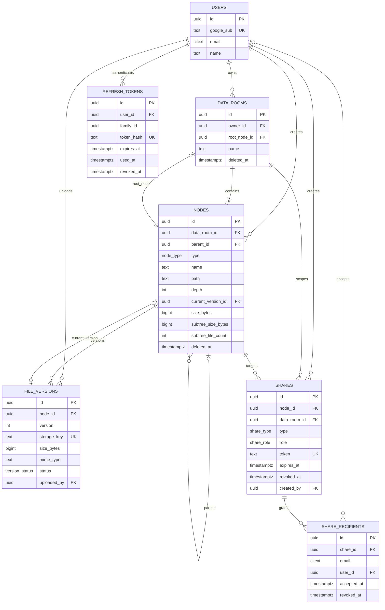

# Data Room

A virtual data room for due-diligence workflows. Owners organize documents into nested folders,
upload files directly to private object storage, and grant read-only access through public links or
email-addressed invitations. Shared users see only the subtree they were granted, and revocation is
effective on the next request.

The workspace contains a React 18/Vite client, a NestJS 10 API, PostgreSQL 15 via TypeORM, a shared
Zod contract package, and Playwright end-to-end tests. Supabase Storage is the production object
store; file bytes never pass through the API.

## What is implemented

- Google OAuth with short-lived access JWTs and rotating, hashed refresh tokens in an `httpOnly`
  cookie.
- Multiple owner data rooms, nested folders, breadcrumbs, keyset-paginated listings, rename, move,
  subtree deletion, exact delete previews, and cached rollups with a nightly drift audit.
- Direct-to-storage multi-file uploads with real XHR progress, concurrency limiting, retry on the
  same reservation, abandoned-upload cleanup, and zero-byte file support.
- In-app PDF viewing and signed 60-second preview/download redirects; other allowed file types remain
  downloadable.
- Public-link and permissioned sharing at room, folder, or file level; immediate revocation and six
  designed access-failure states.
- Row virtualization, keyboard navigation, responsive layouts, reduced-motion support, and rollback
  for optimistic browser mutations.

Filename search and user-editable version history are intentionally not exposed. The schema already
supports file versions; subtree search is designed for a later indexed implementation.

## Architecture

```text
React SPA  ── JSON + credentials ──>  NestJS API  ──>  PostgreSQL
    │                                      │
    └── signed PUT/GET, file bytes ────────┴────>  private Supabase Storage
```

The important boundaries are:

- `packages/contracts` is the API source of truth. Backend contract tests parse every JSON response
  with strict Zod schemas, and the frontend parses responses against those same schemas.
- `PermissionService`, reached through `ReadAccessGuard` and `OwnerGuard`, is the only place that
  decides access. Permission results are never cached, so revocation cannot leave a stale grant.
- Storage is private. The API grants one short-lived signed URL only after its access guard succeeds;
  it never proxies bytes or exposes the Supabase service-role key to the browser.
- PostgreSQL migrations are authoritative and `synchronize` is always disabled. Multi-row tree,
  upload, share, and rollup changes are transactional.

### Principal design decisions

1. **Adjacency list plus materialized path.** Each node stores `parent_id` and a UUID-only `path`
   such as `/root/folder/node/`. Breadcrumbs, subtree scans, and permission ancestry checks avoid
   recursive queries. Moving a subtree costs one transactional prefix rewrite.
2. **Folders and files share one node table.** Rename, move, delete, breadcrumb, and sharing behavior
   has one implementation. File metadata is nullable on folders; cached rollups are meaningful on
   folders.
3. **Uploads reserve before bytes move.** `init` creates an invisible placeholder and pending version,
   then returns a signed write URL. `complete` verifies the object and atomically promotes it. Retry
   reuses the reservation, while abort and the 24-hour sweeper remove abandoned reservations.
4. **Shares target nodes.** Sharing a whole room means sharing its root node. Public links and named
   recipients therefore use the same subtree authorization path, and breadcrumbs are truncated at
   the granting node.
5. **Keyset pagination and virtualized rows from the start.** Folder cost stays stable as it grows,
   inserts cannot create `OFFSET` skips, and the browser does not render an unbounded DOM list.
6. **Database constraints decide name conflicts.** Writes attempt the insert/update and map PostgreSQL
   `23505`; there is no check-then-write race.

## Repository layout

```text
apps/api/             NestJS API, migrations, seed, and backend tests
apps/web/             React client, MSW handlers, and component tests
packages/contracts/   shared Zod request/response contracts and canonical fixtures
e2e/                  Playwright flows and session harness
scripts/              commit ownership validation
```

## Local setup

Requires Node.js 20+ (22 recommended), Docker Compose, a Google OAuth client, and a Supabase
project with a private Storage bucket.

Install the pinned dependencies and create the local environment file:

```bash
corepack enable pnpm
pnpm install --frozen-lockfile
pnpm --filter @dataroom/contracts build
cp .env.example .env
```

In `.env`, set `GOOGLE_CLIENT_ID`, `GOOGLE_CLIENT_SECRET`, `SUPABASE_URL`, and
`SUPABASE_SERVICE_ROLE_KEY`; change `SUPABASE_BUCKET` only if the private bucket is not named
`dataroom`. Keep the supplied local database, origin, and cookie settings. Register this exact
Google callback: `http://127.0.0.1:3000/api/v1/auth/google/callback`.

Prepare PostgreSQL:

```bash
pnpm db:up && pnpm db:migrate && pnpm db:seed
```

Start the API and web app in separate terminals:

```bash
pnpm dev:api
```

```bash
VITE_API_URL=http://127.0.0.1:3000 pnpm dev:web --host 127.0.0.1 --strictPort
```

Open the web app at `http://127.0.0.1:5173`; API health is
`http://127.0.0.1:3000/api/v1/health`. Keep `127.0.0.1` everywhere—mixing it with `localhost`
breaks credentialed CORS and the host-only refresh cookie. Pass Vite flags exactly as shown, without
an extra `--` separator.

If `corepack enable` cannot write to the Node installation, create a writable Corepack shim directory,
add it to `PATH`, and rerun the install; root scripts invoke bare `pnpm` internally.

The real-browser raw `PUT` path to a Supabase signed upload URL remains an external verification item.
Before deploying, confirm the bucket's CORS behavior and `xhr.upload.onprogress` with a real file.

## Verification

The authoritative local/CI gate is:

```bash
pnpm test
```

It runs the contracts fixture tests, API coverage suite, and web coverage suite with the configured
thresholds. `pnpm test:fast` is an ungated inner loop, not a completion check.

Run the complete static and build checks with:

```bash
pnpm lint
pnpm --filter @dataroom/contracts build
pnpm typecheck
pnpm build
```

Backend integration and contract tests start a PostgreSQL Testcontainer and migrate it from empty;
they do not use the developer database. The Playwright suite expects a separately running stack and
the canonical seed:

```bash
set -a; . ./.env; set +a          # DATABASE_URL and JWT_ACCESS_SECRET, from the same file the API read
E2E_WEB_URL=http://127.0.0.1:5173 \
E2E_API_URL=http://127.0.0.1:3000 \
pnpm test:e2e
```

**`DATABASE_URL` must be the API's database, not merely *a* database.** The harness upserts its
identities directly over SQL while the API reads through its own connection, so pointing the two at
different databases produces a suite in which every login fails — and it fails as the signed-out
landing page, which looks exactly like a broken session rather than like a misconfiguration. Sourcing
`.env` rather than pasting a connection string is what makes that impossible; a hardcoded
`postgres://…@localhost:5432/dataroom` in this command was worth fifteen misleading failures once.

The stack it points at must have been started with `WEB_ORIGIN` equal to `E2E_WEB_URL`, for the CORS
reason above; the browser-driven flows fail on the signed-out landing page otherwise.

The harness serializes independent Playwright processes on the same host before they can contend for
the public share endpoint's per-IP rate limit. It keys the process lock by `E2E_API_URL`; when two
aliases reach the same target, give both runs the same `E2E_SHARE_LOCK_KEY`. Distributed CI runners
still need the CI provider's concurrency control because a host-local lock cannot cross machines.

The suite contains 45 tests. Four move bytes and skip unless a real Supabase bucket is available;
set `E2E_STORAGE_READY=true` once its CORS policy is configured. The remaining 41 run against the
local API, PostgreSQL, and Vite stack.

Playwright injects sessions from its own harness rather than adding a production login backdoor.
The actual Google round trip is intentionally a manual deployment check.

## Data model



`data_rooms.root_node_id` is nullable only to allow the circular room/root creation transaction; a
committed room always has a root. Nodes and rooms are soft-deleted, while share revocation is retained
as history. Pending upload placeholders have no `current_version_id` and are excluded from listings and
rollups.

## How it scales

### 1. Total folder size and item count

Exact stats and delete previews use the materialized path as an indexed prefix range, not a recursive
walk. The `text_pattern_ops` path index matters because it lets PostgreSQL use a btree for
`LIKE 'prefix%'` outside the C collation.

Listings read `subtree_size_bytes` and `subtree_file_count` cached on each folder. Upload, delete, and
move transactions update the already-known ancestor IDs in O(depth). A nightly job recomputes every
live folder from completed file nodes and logs drift. It does not auto-repair mismatches because the
mismatch is evidence of a broken transactional mutation path.

If concurrent writes make the room root a hot row, the next tier is an append-only delta ledger:
writers append without contending, a worker compacts deltas, and reads use cached values plus pending
deltas.

### 2. A room with 100,000 files

The model stays the same. Listings use a `(type, sort value, id)` keyset cursor and a partial sibling
index, so later pages do not scan and discard earlier rows. The client fetches bounded pages and
virtualizes rows. Cached header counts avoid repeated full aggregates, while destructive previews remain
exact and run only when opened.

Subtree operations continue to use the materialized-path index. Search would add a normalized-name
column and a room-scoped `pg_trgm` GIN index rather than `LIKE '%term%'`; at multi-million-file scale or
for content search it moves to a dedicated search service. Moves/deletes above a measured threshold
become queued `202` jobs with progress, using the same SQL in a safer execution context. UUID-only flat
storage keys need no directory redesign.

### 3. Per-user viewer/editor roles

The grant already owns its `role`, guards already consume a role rather than a boolean, and overlapping
grants resolve most-permissive-first. Adding `editor` therefore means extending the database/contract
enum, adding permission-matrix cells, and replacing owner-only mutation guards with a role requirement.
It does not remodel the tree or share-recipient tables. The same separation can later absorb group
recipients, deny rules, download restrictions, expiry, or network constraints inside the permission
boundary.

## Security posture

The controls that are load-bearing, and the exceptions that are deliberate.

**Where access is decided.** One service (`PermissionService`), behind one guard, never cached, so
revocation takes effect on the next request. No ownership check exists anywhere outside
`permissions/`.

**Redirects.** `isSafeReturnTo` in `@dataroom/contracts` is the single definition of "same-origin
path", used by the client gate, the sign-in URL builder and the server's OAuth `state` validation.
It rejects `//host`, `/\host`, percent-encoded backslashes and control characters — the browser URL
parser treats `\` as `/` in the authority position, and strips tab/CR/LF before parsing, so all of
those resolve off-origin. Three hand-rolled copies of a weaker rule is how the backslash bypass got
in; there is deliberately one now, with the full case list pinned in both suites.

**Uploaded bytes.** The declared MIME type becomes a fact about the file only at `complete`, which
reads back the content type storage recorded and refuses to promote a version that disagrees — the
browser writes that header itself on its direct `PUT`, so the allowlist at `init` is a claim until
then. `GET /nodes/:id/content` additionally serves `inline` only for `PREVIEWABLE_MIME_TYPES`;
everything else is a download regardless of what the caller asked for. Two independent failures
would be needed to get arbitrary markup rendered from the storage origin.

**Signed URLs.** Reads live 60 seconds; writes live 15 minutes and only `retry` may overwrite. A
write grant is a live capability to replace the bytes at a key, so a longer one meant a completed,
shared, already-read version could be swapped out from under its recipients.

**Rate limiting.** Every route, keyed per client IP: 1,200/min globally (`RATE_LIMIT_PER_MINUTE`),
300/min on the public auth routes, 120/min on `/health` (which runs a real query), 10/min on
`GET /shared/:token`. These bound resource exhaustion, not guessing — the refresh token is 48 random
bytes and the share token 32, so neither is reachable by brute force at any rate.

**Cross-site.** The refresh cookie is `SameSite=None` in production by necessity, so `SameOriginGuard`
refuses `POST /auth/refresh` and `POST /auth/logout` when the browser reports an `Origin` other than
`WEB_ORIGIN`. Without it, any page could spend a visitor's refresh token and log their other tabs
out. `vercel.json` serves the SPA with a CSP (`frame-ancestors 'none'`, `object-src 'none'`,
`worker-src 'self' blob:` for pdf.js), HSTS, `X-Frame-Options`, `nosniff`, and a
`strict-origin-when-cross-origin` referrer policy — the last matters specifically because share
tokens live in the URL path.

**Share tokens and OAuth.** A sensitive `returnTo` is stashed in `sessionStorage` under a random
key, and that key travels through OAuth `state`. If storage is unavailable, sign-in falls back to
`/rooms`, so a `/s/<token>/…` path is never handed to Google. The `state` parameter is encoding,
not encryption.

**Housekeeping.** Expired refresh-token rows are pruned nightly; a revoked row is kept for a full
refresh lifetime past revocation, because it is what makes a replay *detectable* rather than an
ordinary "no such token".

## AI usage

AI coding agents were used to turn the written brief into contracts and specs, implement both
applications, generate and review tests, investigate failures, and maintain the decision/deviation
record. The workflow was contract → specification → failing test → implementation, with separate
adversarial QA passes and coverage gates. AI output was treated as untrusted engineering work: behavior
is accepted only when it is represented in the shared contract or a written deviation and exercised by
the automated suite. External credentials and deployment ownership stay with the project owner.
